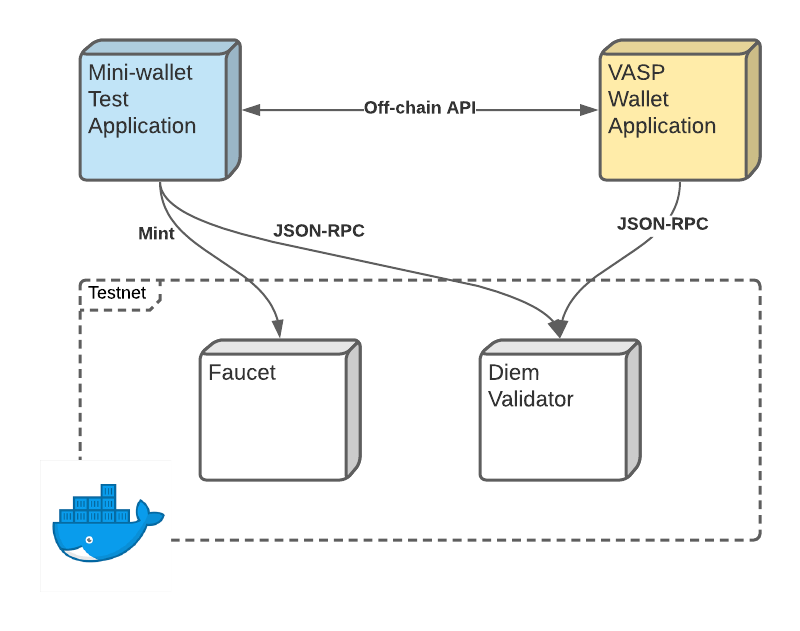
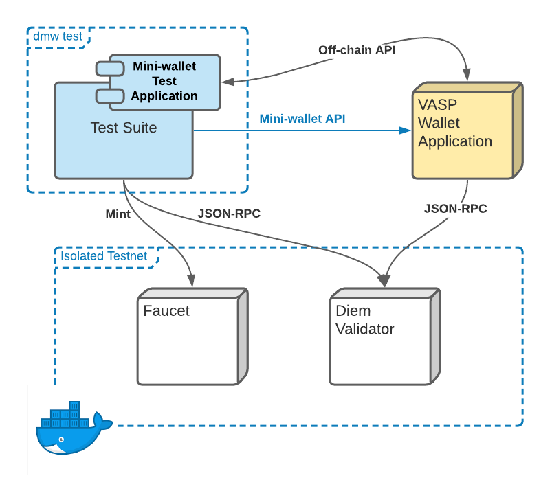

## Diem MiniWallet


## Introduction

The Diem MiniWallet is a simplified wallet that can be run from the command line. You can use the Diem MiniWallet (and the included testing suite) to test your wallet application and to help develop your app to meet our requirements.

The Diem MiniWallet connects to the Diem testnet by default. If you want to use the Diem MiniWallet to test in your local test network, read the instructions here.

The following diagram shows how the Diem MiniWallet may work with your wallet application in a local testnet:




## Instal the Diem MiniWallet

1. Install the Diem Python SDK with the MiniWallet and it’s Test Suite (both included since version 1.2.6) using this command: `pip install diem[all]`. You may need to use quotes around `'diem[all]'`.
You may need to use quotes `pip install 'diem[all]'`.

	To include the Diem MiniWallet in a pip requirements.txt file add:
	`diem[all]>=1.2.6`

2. Once you’ve run the pip install command, the Diem MiniWallet (dmw) CLI will be installed in your pip environment. To view the available CLI subcommands, run:
	`dmw --help`

## Start the Diem MiniWallet Server

The Diem MiniWallet server connects to the Diem testnet by default. To start the server, run:
`dmw start-server`


`start-server` options:

```
dmw start-server --help

Usage: dmw start-server [OPTIONS]

Options:
  -n, --name TEXT                 Application name.  [default: mini-wallet]
  -H, --host TEXT                 Start server host.  [default: localhost]
  -p, --port INTEGER              Start server port.  [default: 8888]
  -u, --diem-account-base-url TEXT
                                  The address that will be used for offchain
                                  callbacks. Defaults to
                                  http://localhost:{port}

  -j, --jsonrpc TEXT              Diem fullnode JSON-RPC URL.  [default:
                                  http://testnet.diem.com/v1]

  -f, --faucet TEXT               Testnet faucet URL.  [default:
                                  http://testnet.diem.com/mint]

  -o, --disable-events-api        Disable account events API.  [default:
                                  False]

  -l, --logfile PATH              Log to a file instead of printing into
                                  console.

  -i, --import-diem-account-config-file FILENAME
                                  Import the diem account config from a file.
                                  The config file content should be JSON
                                  generated from command `gen-diem-account-
                                  config`.

  --hrp TEXT                      Set Diem account identifier hrp; if '-i'
                                  option is used, this option overwrites hrp
                                  configured by '-i' option.

  -h, --help                      Show this message and exit.
```

View the Diem MiniWallet API specification (OpenAPI Specification 3.0.3) by opening http://localhost:8888. These specs include simple examples to try out the MiniWallet API. A hosted version of the API specification document is also available [here](https://diem.github.io/client-sdk-python/mini-wallet-api-spec.html).


## Use the Diem MiniWallet Test Suite

The Diem MiniWallet Test Suite is a set of tests built on top of the Diem MiniWallet API and is used to validate a wallet app’s integration with the Diem Payment Network (DPN).

The following diagram shows how the test suite works with your wallet application behind the MiniWallet API in a local testnet environment:



Use the MiniWallet Test Suite to automate testing and checking if your wallet application meets our requirements.

1. To test the wallet application we started by `dmw start-server -p 8888`:
	`dmw test --target http://localhost:8888`

	You should see the following test report:

	```
    Diem JSON-RPC URL: http://testnet.diem.com/v1
    Diem Testnet Faucet URL: http://testnet.diem.com/mint
    =========================================== test session starts ==============================================
    collected 181 items

    src/diem/testing/suites/test_create_test_account.py .........                                           [  4%]
    src/diem/testing/suites/test_generate_account_identifier.py .                                           [  5%]
    src/diem/testing/suites/test_offchain_protocol_error_cases.py ...................                       [ 16%]
    src/diem/testing/suites/test_payment_command.py ..................................................      [ 46%]
    src/diem/testing/suites/test_ping_command.py .                                                          [ 47%]
    src/diem/testing/suites/test_receive_payment.py ....................................................... [ 82%]
    src/diem/testing/suites/test_send_payment.py ...............................                            [100%]

    ========================================== 181 passed in 46.18s ==============================================
	```


2. Create a proxy server for your wallet application using the Diem MiniWallet API specification. Assuming you're running your application at port 9999, run the MiniWallet Test Suite using this command:

	```
	dmw test --target http://localhost:9999
	```

	`test` options:
	```
	dmw test --help

	Usage: dmw test [OPTIONS]

	Options:
	  -t, --target TEXT               Target mini-wallet application URL.
	                                  [default: http://localhost:8888]

	  -H, --stub-bind-host TEXT       The host the miniwallet stub server will
	                                  bind to  [default: localhost]

	  -p, --stub-bind-port INTEGER    The port the miniwallet stub server will
	                                  bind to. Random if empty.

	  -u, --stub-diem-account-base-url TEXT
	                                  The address that will be used for offchain
	                                  callbacks. Defaults to
	                                  http://localhost:{port}

	  -j, --jsonrpc TEXT              Diem fullnode JSON-RPC URL.  [default:
	                                  https://testnet.diem.com/v1]

	  -k, --match-keywords TEXT       Only run tests which match the given
	                                  substring expression. Same with pytest `-k`
	                                  option. Example: -k 'test_method or
	                                  test_other' matches all test functions and
	                                  classes whose name contains 'test_method' or
	                                  'test_other', while -k 'not test_method'
	                                  matches those that don't contain
	                                  'test_method' in their names

	  -f, --faucet TEXT               Testnet faucet URL.  [default:
	                                  https://testnet.diem.com/mint]

	  --pytest-args TEXT              Additional pytest arguments, split by empty
	                                  space, e.g. `--pytest-args '-v -s'`.

	  -l, --logfile PATH              Log to a file instead of printing into
	                                  console.

	  -v, --verbose                   Enable verbose log output.  [default: False]
	  -i, --import-stub-diem-account-config-file FILENAME
	                                  Import the diem account config from a file
	                                  for the miniwallet stub server. The config
	                                  file content should be JSON generated from
	                                  command `gen-diem-account-config`.

	  --stub-hrp TEXT                 Set Diem account identifier hrp for the stub
	                                  wallet application; if '-i' option is used,
	                                  this option overwrites hrp configured by
	                                  '-i' option.

	  --wait-for-target-timeout INTEGER
	                                  Before start test, the target wallet
	                                  application host port should be ready for
	                                  connection. This is wait timeout (seconds)
	                                  for the port ready.  [default: 20]

	  --include-offchain-v2           Include offchain v2 test suites  [default:
	                                  False]

	  -h, --help                      Show this message and exit.
	```

### How it works

`dmv test` launches a pytest runner to run Diem MiniWallet Test Suite tests in `diem.testing.suites` package.

`diem.testing.suites` package includes a `conftest.py`, which will be loaded by pytest for setting up test fixtures.

A package scope fixture in the `conftest.py` starts a MiniWallet application named `stub-wallet` as a counterparty service for testing payment with the target server specified by the `--target` option here.

### Work with a local testnet

The Diem MiniWallet server connects to the Diem testnet by default. However, you can use the MiniWallet to test your wallet application in your own local test network as well.

To run your local test network:
1. Download and install [Docker](https://docs.docker.com/get-docker/) and Docker Compose (comes with Docker for Mac and Windows).
2. Download the [Diem testnet docker compose configuration file](https://github.com/diem/diem/blob/main/docker/compose/validator-testnet/docker-compose.yaml) and [Diem node configuration file](https://github.com/diem/diem/blob/main/docker/compose/validator-testnet/validator_node_template.yaml); place them in same directory.
3. Run the following command: `docker-compose -f <path to your validator-testnet/docker-compose.yaml file> up --detach`
	* The Faucet service will now be available at http://127.0.0.1:8000.
	* A JSON-RPC server will now be available at http://127.0.0.1:8080.
4. Test your wallet application with your local test network using:
`dmw test --jsonrpc http://127.0.0.1:8080 --faucet http://127.0.0.1:8000 --target http://localhost:9999`

### Test Off-chain API

As the test counterparty wallet application server is started locally, you need to make sure your wallet application's off-chain API can access the stub server using it's base_url: `http://localhost:<port>`.

If your wallet application is not running locally, you will need to set up a tunnel for your wallet application to access the stub server.


## Run Mini-wallet application in a docker container

Download the [Mini-wallet service docker compose file](./docker-compose/mini-wallet-service.yaml).

Start a local mini-wallet application with Diem global testnet:

`docker-compose -p dmw -f mini-wallet-service.yaml up --detach`

You can combine it with [Diem testnet docker compose configuration file](https://github.com/diem/diem/blob/main/docker/compose/validator-testnet/docker-compose.yaml) and launch the mini-wallet service with local testnet:

```
DIEM_JSON_RPC_URL="http://validator:8080" DIEM_FAUCET_URL="http://faucet:8000/mint" \
docker-compose \
	-p dmw \
	-f <path to your validator-testnet/docker-compose.yaml file> \
	-f mini-wallet-service.yaml \
	up --detach
```

## Run Test Suite in a docker container

In this example, we use a Mini-wallet application launched by [Mini-wallet service docker compose file](./docker-compose/mini-wallet-service.yaml) as test target. You may replace it with your application's compose file for testing your application.

Start a target wallet application:

```
DIEM_JSON_RPC_URL="http://validator:8080" DIEM_FAUCET_URL="http://faucet:8000/mint" \
docker-compose \
	-p dmw \
	-f <path to your validator-testnet/docker-compose.yaml file> \
	-f mini-wallet-service.yaml \
	up --detach
```

Run `dmw test` in a docker container against the target wallet application:

```
docker run \
	--name dmw-test-runner \
	--network diem-docker-compose-shared \
	--rm \
	-t \
	-p "8889:8889" \
	"python:3.8" \
	/bin/bash -c "apt-get update && \
		pip install diem[all] && \
		dmw test \
		--jsonrpc http://validator:8080/v1 \
		--faucet http://faucet:8000/mint \
		--target http://mini-wallet:8888 \
		--stub-bind-host 0.0.0.0 \
		--stub-bind-port 8889 \
		--stub-diem-account-base-url http://dmw-test-runner:8889"
```

Note: `http://mini-wallet:8888` is the target wallet application URL.
